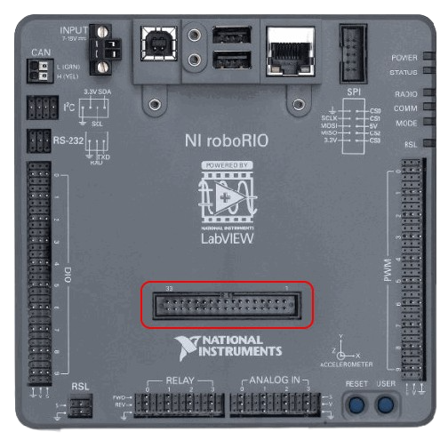
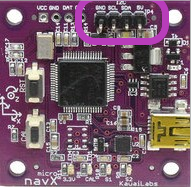
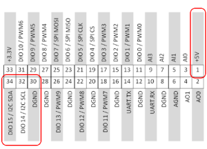

# Swerve Drive Test

This is a attempt at programming the REV MAXSwerve drive. Honestly this is mostly a
rewrite of the REV MAXSwerve [Java Example](https://github.com/REVrobotics/MAXSwerve-Java-Template).
I just rewrote it to gain a better understanding of what is going on under the hood
for when we try to incorperate the Limelight 3 into this for exact positioning on
the field. I also wanted to try my hand at command based programming instead of timed,
since I've heard it was better and wanted to see for myself. The gyro used in the
[Java Example](https://github.com/REVrobotics/MAXSwerve-Java-Template) has been
switched out with the [NavX-micro](https://www.andymark.com/products/navx2-micro-navigation-sensor?via=Z2lkOi8vYW5keW1hcmsvV29ya2FyZWE6Ok5hdmlnYXRpb246OlNlYXJjaFJlc3VsdHMvJTdCJTIyYnV0dG9uJTIyJTNBJTIyc2VhcmNoJTIyJTJDJTIycSUyMiUzQSUyMm5hdnglMjIlMkMlMjJ1dGY4JTIyJTNBJTIyJUUyJTlDJTkzJTIyJTdE),
since we have one on the way.

## Important
The onboard I2C is known to hang, causing system lockups, so this test is 
set up to use the I2C pins on the MXP Port, highlighted on the picture:

The matching I2C pins on the NavX-micro and the MXP Port should be connected.
These pins are shown in the following pictures:

